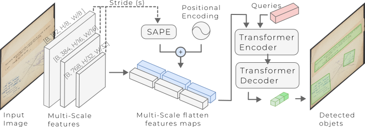

# SA-DETR: Scale-Aware DEtection TRansformer
[](https://mchelali.github.io/SA-DETR/)
[]([#](https://huggingface.co/datasets/mchelali/forbin_dataset))
[](https://github.com/mchelali/SA-DETR)

Scale-Aware Detection Transformer for Historical Document Analysis

<div style="background: #c9c6c6a1; text-align: center; padding: 10px;">
    
</div>


SA-DETR is a transformer-based detection framework designed for robust detection of complex visual elements (e.g., administrative stamps) in historical documents.
It is particularly effective on:
* degraded archival documents
* multi-scale objects
* irregular shapes (Bezier-based representations)

## Installation
 You can use poetry

### Clone repository

```bash
git clone https://github.com/your-username/sa-detr.git
cd sa-detr
```

### Environment setup

Option A — using `venv`

```bash
python -m venv venv
source venv/bin/activate  # (Linux/Mac)
venv\Scripts\activate     # (Windows)

pip install --upgrade pip
```

Option B — using `poetry` (recommended)
```bash
poetry install
poetry shell
```
### Install dependencies

```bash
python -m pip install --no-build-isolation -e detectron2
python -m pip install --no-build-isolation -e .
```

## Data Preparation

Enrich your COCO with Bezier annotations:
```bash
python utilities/add_bezier2coco.py <input.json> <output.json>
```

## Usage

### Trainning

K-Fold training on Forbin dataset
```bash
python tools/train_kfold.py --config-file configs/R_50/forbin_stamp.yaml --folds-dir datasets/forbin_dataset/ --image-root datasets/forbin_dataset/ --n-folds 5 
```


Standard training (StaVer dataset)

```bash
python tools/train_net.py --config-file configs/R_50/staver.yaml 
```

### Inference / Evaluation

```bash
python tools/train_net.py --config-file configs/R_50/staver.yaml --eval-only MODEL.WEIGHTS output/staver/model_best.pth
```

### Monitoring (TensorBoard)

```bash
tensorboard --logdir output/ --host 0.0.0.0 --port 8000
```

# Vizualization

Single image or folder
```bash
python demo/demo.py --config-file configs/R_50/mlt19_historical/finetune.yaml --input ${IMAGES_FOLDER_OR_ONE_IMAGE_PATH} --output ${OUTPUT_PATH} --opts MODEL.WEIGHTS output/historic_R50_finetune/model_best.pth
```


Full dataset visualization

```bash
python demo/vizualization.py --pred-json output/forbin_stamp/forbin_stamps_fold0/inference/coco_predictions.json --gt-json datasets/forbin_dataset/test_fold_0_single.json --image-base-path datasets/forbin_dataset/ --output output/forbin_gt/  --coco-mode gt_only --alpha 0.3
```

## Acknowledgements

This project builds upon the original implementation of 
DeepSolo, a scene text detection and recognition framework.

We sincerely thank the authors for releasing their code and models,
which significantly contributed to the development of this work.

This research extends DeepSolo towards the analysis of historical
documents, with a focus on administrative stamp detection and
digital humanities applications.

# Citation

```bibtex
@inproceedings{mchelali26_sape,
  title={Scale-Aware DEtection TRansformer for Historical Document Analysis},
  author={M., Chelali, et al.},
  booktitle={Proceedings of ICDAR},
  pages={XX--XX},
  year={2026}
}
```


